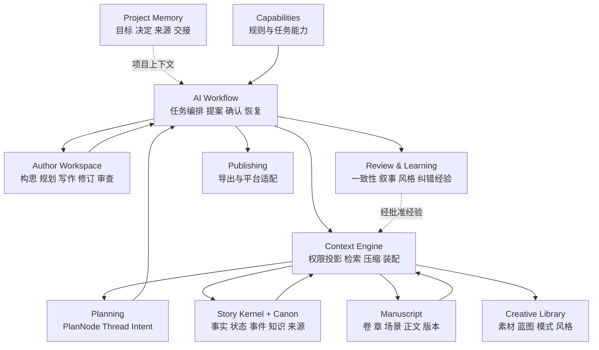

# Novel-AI-OS V5 总体蓝图

Status: proposed_design_baseline  
Updated: 2026-09-14  
Sources: SRC-001–SRC-008

本页是 V5 的总入口：说明系统要解决什么、已经确定什么、各模块怎样配合、哪些仍是提案、怎样继续实现。细节由链接文档承担；发生冲突时，accepted ADR 高于本页，项目事实以 PROJECT_STATE 为准。

## 1. 产品本体

Novel-AI-OS 是面向长篇小说创作的本地优先创作操作系统。它保存作品事实、作者意图、计划、正文、人物认知、读者暴露、素材来源与 AI 候选变更，让作者可以构思、规划、写作、修订、审查和长期续写。

系统的核心价值不是一次生成更多字，而是在几十万到数百万字范围内持续回答：

- 当前故事版本中什么是真的，什么只是计划、传闻、误解或建议；
- 在这个故事时点，当前视角人物和读者分别知道什么；
- 当前场景需要哪些事实、原文、线程、风格与约束；
- 新正文改变了哪些状态、关系、知识和未完线程；
- AI 的推断来自哪里，能否复核，是否需要作者确认；
- 改写旧章节、切换分支、跨世界或时间重置后，哪些派生资料需要失效和重建。

当前仓库仍是**设计与项目记忆仓库**。文档基线已形成，创作应用、数据库、检索服务、UI 和模型运行时尚未实现。

## 2. 已确定原则

| 原则 | 已确定内容 | 对实现的直接约束 |
| --- | --- | --- |
| P1 通用 Kernel | 所有故事共享 Entity、Rule、State、Relation、Event、Knowledge、Derivation、Provenance | 不为修仙、推理、爱情等另建互不兼容的事实系统 |
| P2 平台无关 | 发布平台策略位于外围 Publishing | 番茄、起点、七猫的规则不能成为核心必填字段 |
| P3 题材非底层 | Genre 是组织标签或能力预设 | 题材变化不触发项目迁移 |
| P4 Capability 组合 | 能力可叠加、局部启用并显式报告冲突 | 一本书可以同时使用推理、关系、灾难、成长与循环能力 |
| P5 Library/Canon 隔离 | 素材原版、故事实例和故事事实分别版本化 | 某故事中的经历不得污染素材原版或其他故事 |
| P6 作者控制 Canon | AI 只能提出候选，不能静默确认正式事实 | 生成、摘要、检索、审查和提取都没有 Canon 批准权 |

详见 [架构原则](ARCHITECTURE_PRINCIPLES.md)、[已确定决定](../../SETTLED_DECISIONS.md) 和 [ADR](../../adr/README.md)。

## 3. 系统分层

这是逻辑边界，不表示需要十个服务。首版适合采用一个模块化后端、一个桌面界面和一个主数据库。

## 4. 核心数据域

### 4.1 Story Kernel 与 Canon

Kernel 提供通用语义；Canon 表示作者已确认、在指定作品、分支、版本、时间和范围内生效的断言。每条正式记录至少能追踪：身份、作用域、版本、状态、有效时点和来源。

- Entity：可持续引用的人、地点、组织、物品、能力、世界或概念。
- Rule：条件、作用域、效果、例外和生效期。
- State：实体在某时点或区间的状态。
- Relation：实体之间随时间变化的结构、情感、社会、资源或因果联系。
- Event：使状态、关系或知识发生变化的故事事件。
- Knowledge：某主体对某命题的知道、相信、怀疑、误信或遗忘。
- Derivation：素材、版本、实例、蓝图和改编之间的派生链。
- Provenance：作者输入、正文位置、导入来源、AI 提取、推断、确认和替代链。

Proposition 可作为 Knowledge 的被认知内容和 Canon 断言表达，但暂不升格为第九种顶层对象。正文动作只有在产生长期状态、关系、知识、目标或因果影响时才需要结构化为 Story Event。

### 4.2 Manuscript

正文不是 Canon 数据库的渲染结果，也不是唯一事实库。Manuscript 保存作品结构、原文、修订和叙事顺序：Book → Part/Volume → Chapter → Scene → Text Span。故事时间与叙事位置分离，以支持回忆、插叙、并行线、循环和重置。

Scene 是主要写作与状态锚点。它拥有 POV、叙事位置、故事时点、地点、参与者、入场状态、目标、阻力、信息变化、退出变化和正文锚点。章节和卷是更高层容器，不应替代真实故事时间。

### 4.3 Planning

Planning 保存尚未发生的作者意图，不把计划写成事实。最小稳定概念建议为：

- AuthorIntent：作者希望作品、阶段、场景或修改达到什么效果；
- PlanNode：一个可移动、可拆分、可实现或偏离的计划变化；
- NarrativeThread：跨场景延续的问题、关系、目标、谜团、承诺或期待。

Story Core、Story Spine、Arc Contract、Volume Goal、Chapter Mission、Scene Plan 是这些概念的组合视图。计划与实际通过 realizes、deviates_from、supersedes 等关系连接，不覆盖历史计划。

NarrativeThread 建议支持 Seeded、Open、Developing、Escalating、Payoff、Subverted、Abandoned，并记录建立、发展、兑现、延迟和后果。Reader Expectation 是线程的一种观察方式，不把“每章必须有钩子”固化为规则。

### 4.4 Knowledge 与 Reader State

至少区分四种信息面：

1. World Truth：在当前 Canon 快照下成立的事实；
2. Character Belief：人物在某时点知道、相信、怀疑或误信的命题；
3. Reader Exposure：正文到某叙事位置实际暴露的线索、说法和事实；
4. Author Secret：作者允许系统用于规划和审查，但禁止泄漏给人物或正文的秘密。

“AI 作为作者助手可读”与“当前生成文本可以表达”是两套权限。派生摘要、缓存、日志和模型调用也必须继承同一权限标签，避免通过二次资料泄漏未来信息。

### 4.5 Creative Library

Library 保存跨作品复用的 Inspiration、Blueprint、Pattern、Style Profile 和外部参考。导入故事时创建 Story Instance 或固定版本引用；故事经历只修改实例。将故事中的新变化提炼回 Library 时，创建独立候选版本并重新确认。

### 4.6 Capability 与 Skill

Capability 是对通用对象提供领域理解、约束、检查或生成辅助的可组合单元。每个能力声明版本、适用任务、所需数据、可读范围、可提出的变化、依赖、冲突和输出结构。

Skill 是一种可执行工作方法或提示资源。它可以请求上下文、生成计划、正文或审查意见，但不能扩大 ContextGrant，不能维护第二份 Canon，也不能注册绕过 Canon Inbox 的写入通道。

## 5. Context Engine

Context Engine 的定义是：**在指定项目版本、故事时点、叙事位置和知识权限下，为当前任务编译足够、有据、可追溯的模型输入。**

标准流程：

1. Task Contract 明确任务类型、目标、作品/分支、叙事位置、故事时间、POV、允许读取的秘密、预算和输出契约。
2. Policy Gate 先按作品、分支、版本、时间、人物知识、读者位置和权限做硬过滤。
3. Query Planner 生成结构化查询、关键词、实体、线程和必要的多跳扩展。
4. Retriever 并行读取 Canon/State、局部原文、计划、摘要和已授权风格；默认采用结构化查询 + FTS/BM25，语义检索按评估启用。
5. Reranker/Resolver 去重、发现冲突、标记缺口，不能通过排序重新引入越权材料。
6. Budgeter 保留关键约束、近期原文、相关事实和来源；按任务压缩次要材料。
7. Assembler 输出 Context Packet：内容、类型、版本、来源、有效范围、置信/状态、缺失与冲突。
8. 生成后进行引用核对、连续性检查和候选变化提取；进入 Canon Inbox，作者确认后才提交。

百万字长篇默认不把全书原文塞进窗口。近期场景使用高保真原文，远期内容使用可失效的场景/章/卷/实体摘要，关键事实通过结构化状态查询获取。RAG 负责从大量资料中选证据；长上下文负责在已经正确选择的材料中综合。全书级审计采用分层 Map → Reduce → Verify，而不是一次提示。

详见 [Context Engine 深度研究](../research/CONTEXT_ENGINE_RESEARCH_2026-09-09.md) 与 [模块规格](../context/CONTEXT_ENGINE.md)。

## 6. AI 工作流

### 新建作品

想法或已有材料 → 提取 Story Seed → 给出多个可选方向 → 作者逐步确认 Story Core → 创建初始人物、世界和线程候选 → 形成第一组 Scene Plan。系统允许从一句想法、既有人设、大纲、已写正文或完整导入作品进入，不强迫统一起点。

### 写一个场景

Scene Mission → Context Contract → Context Packet → Draft → 连续性/知识/风格审查 → 展示正文与事实差异 → 作者接受正文并逐项处理候选变化 → 提交 Canon → 失效相关摘要和缓存。

### 修改旧章节

读取目标版本和修改点前状态 → 生成候选改写 → 计算对后续事件、状态、知识、线程和摘要的影响 → 展示影响范围 → 作者决定创建分支、向前传播或放弃 → 在同一基线上事务提交。

### 导入长篇

原文不可变入库 → 划分篇章场景和锚点 → 批量提取候选实体/事件/状态/知识 → 聚类与冲突报告 → 作者按优先级确认 → 生成可重建的摘要与索引。导入分析不能直接把模型提取设为 Canon。

### 审查与学习

审查按事实一致性、人物知识、因果、线程、场景功能、风格和作者意图分层输出证据。作者对建议的接受、拒绝和修改可形成 Procedural Memory 候选；只有明确批准、适用范围清楚且可撤销时才参与未来任务。

## 7. 作者界面

最小界面应让作者始终看见当前作品、分支、章节/场景、Canon 基线和 POV。核心工作区包括：

- 写作区：正文、场景目标、相关事实和近期原文；
- 侧边上下文：人物当前状态、所知信息、活跃线程、规则与来源；
- Canon Inbox：逐项显示“从什么变成什么”、来源、影响范围和冲突；
- 时间线/线程视图：计划与实际并列，支持回忆、并行和重置；
- Story Bible：Canon 的可读投影，编辑时生成候选命令；
- Library：原版、故事实例、派生链和升级差异；
- Context Inspector：显示本次模型实际收到什么、为何入选、哪些被过滤或截断；
- Review：按证据展示问题，不把所有维度强行折算为单一总分。

详细操作见 [作者工作流](../product/AUTHOR_WORKFLOWS.md)。

## 8. 技术基线建议

首版建议本地优先、单作者、模块化单体：

- 桌面：Tauri 2 + React/TypeScript；若团队更熟 Electron，可替换而不影响领域契约；
- 应用服务：TypeScript；复杂离线 NLP 可通过独立 Python worker 后置引入；
- 主存储：SQLite，外键、事务、JSON 字段、FTS5；
- 原文与附件：内容寻址文件存储，数据库保存 hash、版本与锚点；
- 检索：结构化 SQL + FTS5/BM25 起步；向量检索作为可替换适配器；
- 缓存：进程内 LRU + 数据库派生缓存，均带依赖版本和权限指纹；
- 模型：统一 Model Adapter，任务策略选择云端或本地模型；不把供应商会话当记忆库；
- 可观测性：记录 Context Manifest、token、延迟、模型、检索候选、入选原因和引用；正文/秘密日志默认本地化和可控；
- 导出：Markdown/JSON/EPUB/DOCX 等外围适配器，不反向定义故事模型。

只有在基准证明收益后再引入向量扩展、图数据库、多代理编排、分布式队列或独立搜索集群。技术细节见 [Context Engine 研究](../research/CONTEXT_ENGINE_RESEARCH_2026-09-09.md) 和 [实现边界](../technical/IMPLEMENTATION_BOUNDARIES.md)。

## 9. 评估体系

离线基准以“必须包含／不得包含／必须回查原文／预期缺口”作为标准答案。核心指标：

- Canon/continuity recall：必要事实覆盖率；
- Forbidden-context rate：未来信息、他人秘密、其他故事、错误分支混入率；
- Provenance precision：输出主张可定位到正确版本和原文的比例；
- Temporal/POV consistency：时间、状态和人物知识是否正确；
- Contradiction exposure：冲突是否被发现而非静默覆盖；
- Context efficiency：有效证据 token / 总上下文 token；
- Downstream faithfulness：正文是否遵循提供的事实与限制；
- Author effort：作者纠错、确认和查找证据所需操作；
- Cost/latency：每场景、每章、每十万字导入和全书审计的成本与等待时间。

必须测试：同名人物跨作品、分支分叉、旧章改写、回忆、时间循环、人物误信、作者秘密、Library 升级、摘要过时、预算不足和检索不到关键事实。

## 10. 七技能融合结论

七套历史技能适合作为工作流与方法来源，不是七套并列架构。可吸收的是持续记忆、卷章任务、写前读取、写后回填、线程生命周期、Plan/Actual、分层审查和证据化风格学习。需要改造的是平台语言、固定节奏、Markdown 状态文件和关键词规则；应拒绝自动覆盖 Canon、跨作品污染、作者人格克隆和把固定公式写入通用底层。

逐项映射和证据限制见 [七技能重新审计与融合报告](../research/SEVEN_SKILLS_AUDIT_AND_FUSION_V1.md)。

## 11. 外部方法不能直接照搬

- “窗口够大就放全书”：长距离注意、位置偏差、成本和权限隔离仍然存在。
- 纯向量相似度决定上下文：相似不等于当前版本、当前时间或当前人物有权知道。
- GraphRAG 默认全量部署：图的维护、版本和错误边成本可能超过收益。
- 摘要覆盖原文：摘要是派生导航，不是新的事实来源。
- 自动写回长期记忆：把模型推断直接保存会积累污染。
- 单一 Story Bible Markdown 作为全部真相：覆盖式更新丢失历史、分支、时点和来源。
- 题材模板即数据库：混合题材和中途转向会导致迁移与重复身份。
- 每章固定爽点、反转或字数：这些只能是可选创作策略。
- 总分驱动审查：不同作者意图不能被一个固定权重分数替代。
- 多 Agent 越多越好：角色边界、上下文复制和协调成本需要任务收益证明。

## 12. 状态总表

| 内容 | 当前状态 |
| --- | --- |
| P1–P6 原则 | accepted |
| 仓库项目记忆与交接协议 | active working system |
| 总体蓝图、模块边界和数据流 | proposed design baseline |
| Context Engine 外部研究与推荐方案 | research completed；工程方案 proposed |
| 七技能融合矩阵 | reconstructed audit；原包逐文件核验待补 |
| Kernel/Canon/Knowledge/Proposal 最小契约 | proposed，待场景评审与 ADR |
| Blueprint/Derivation、memory-first ADR | proposed |
| 技术栈 | recommended baseline，未接受/未实现 |
| UI/作者工作流 | proposed |
| 产品代码、数据库、检索、模型运行时 | not started |
| 运行时评估和独立接手测试 | pending |

## 13. 近期实施顺序

1. 冻结可实现的 Kernel、Scope、Timeline、Knowledge、Proposal 和 Canon transaction 最小契约，并完成 S1–S6 纸面评审。
2. 建立含两部作品、分支、误信、秘密、循环和过时摘要的评估夹具。
3. 实现 SQLite + FTS5 的本地纵向切片：导入 Scene → 查询状态 → 编译 Context Packet → 生成候选 → Canon Inbox → 提交与失效。
4. 实现作者最小界面和 Context Inspector，测量一次场景创作的作者操作成本。
5. 对 Long Context、FTS、向量、关系扩展和摘要做消融；仅为有显著收益的部分增加复杂度。
6. 扩展 Planning、Library、Review、Style Learning 和导出；多人、云同步、图数据库、多代理和平台适配后置。

具体任务、完成条件和问题见 [Roadmap](../../planning/ROADMAP.md)、[Open Questions](../../planning/OPEN_QUESTIONS.md) 和 [Current Task](../../planning/CURRENT_TASK.md)。

## 14. 长期扩展边界

可扩展方向包括：多作品宇宙、协作写作、可视化时间线、规则模拟、异常设定压力测试、推理公平性审查、角色模拟、出版变体、翻译本地化、音频/影视改编和插件市场。每项扩展必须通过 P1–P6，并声明：读取什么、可提出什么、写入哪里、怎样版本化、怎样撤销、怎样评估。

系统未来可以理解读者体验、平台要求和商业策略，但这些只能作为分析或外围适配，不自动成为作者意图，更不能重写作品本体。

## 15. 未决问题入口

未决问题不散落在本页。唯一主记录是 [OPEN_QUESTIONS](../../planning/OPEN_QUESTIONS.md)，包括历史覆盖、核心契约、人物/读者知识、Context 选型、摘要失效、Library 派生、技术栈、作者操作路径、评估、隐私、协作和扩展治理。关闭问题需要保留结论、证据、日期和关联 ADR。

