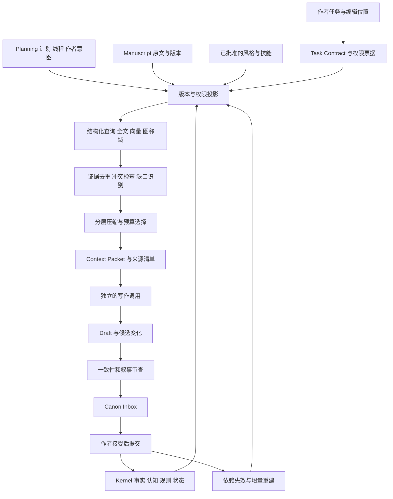

# V5 小说创作系统 Context Engine 研究与架构设计

## 1 核心结论与资料边界

建议将 Context Engine 定义为：**在指定作品版本、故事时点、叙事位置和知识权限下，针对当前任务，编译足够、有据、可追溯的模型输入。**

它首先解决“这次允许知道什么、必须知道什么、哪些仍未确定”，然后才解决“检索得准不准、能否省 token”。推荐形态是：版本化 Story Kernel 与 Planning 提供事实和意图，权限投影限定候选范围，结构化查询与混合检索寻找证据，预算器形成 Context Packet，写后提取候选变化并经 Canon Inbox 提交。

百万字不要求每次把全书放入模型，也不要求一开始部署图数据库。默认采用受限检索加适度长上下文；全书分析走另一条可分解、可复核、成本更高的工作流。

本报告面向通用长篇小说系统的产品与工程设计，研究证据截止 2026 年 9 月 9 日。内容属于可用于技术规格讨论的架构建议，尚未实现或通过 V5 性能测试。

设计继承《优化小说创作架构》讨论记录中较晚确定的约束：

- Kernel 保持 Entity、Rule、State、Relation、Event、Knowledge、Derivation、Provenance 的通用语义。
- Planning 收束为 PlanNode、NarrativeThread、AuthorIntent；Story Spine、Arc Contract、Chapter Mission 是组合视图。
- 不要求作者先选择题材；新故事能力按需组合。
- V5 已明确取消平台适配；本设计不再把番茄、七猫、起点策略放回创作核心。
- 全局 Creative Library 与书内实际经历隔离；AI 提取不能静默改 Canon。

**资料边界：**可用的内部依据是《优化小说创作架构》的历史讨论记录；novel-skills-7pack.tar.gz 原始压缩包、原 V4.1 文档和 V5 源代码未获得可核验副本。因此，七套技能的融合分析属于基于历史记录的映射，未完成压缩包逐文件复核；历史记录中的文件数量与去重统计不作为已验证事实。V5 兼容性结论针对已讨论的概念接口，不是针对现有代码的迁移审计。

论文按可核验发表或修订时间纳入；产品文档以本轮读取的滚动版本为准，无日期的页面不冒充历史快照。“截至截止日的研究”表示本轮检索覆盖到该时点，不表示穷尽全部论文。文中具体阈值、预算、工作量均标为建议或估算，不能替代 V5 实测。

## 2 Context Engine 在 V5 中的位置



这是逻辑模块图，**不代表每个框都需要独立服务**。首版用一个模块化后端和一个数据库足够。Context Engine 不创造第二份 Canon，也不自己决定剧情应当怎样发展。

| 现有模块 | 它拥有的数据或权力 | Context Engine 的边界 |
|---|---|---|
| Story Kernel | 已提交的世界对象、规则、事件、认知与历史状态 | 只查询指定快照；不能因检索结果覆盖 Canon |
| Planning | 未来变化、叙事线程、作者意图、计划与实际偏差 | 编译适合当前任务的计划切片，不能将计划变成已发生事件 |
| Manuscript | 卷章场景、正文、修订与阅读顺序 | 保留原文锚点；局部改写可读取授权的后文接续点 |
| Reader Model | 文本暴露了什么，以及读者可能推断什么 | 暴露记录可核验；“读者一定懂了”只能是推测 |
| Knowledge | 每个认知主体的听闻、信念、观察、误解与遗忘 | 人物上下文查询此模块，不从世界真相反推人物一定知道 |
| Review 与 Learning | 审查问题、作者修改、候选写作经验 | 只注入当前适用、已批准且未失效的经验 |
| Creative Library | 灵感、蓝图、模式及派生关系 | 只有已导入本书的实例参与默认续写；跨书检索必须显式开启 |
| Workflow 与 Model Adapter | 调用步骤、模型、重试、预算与工具授权 | Context Engine 提供输入包；供应商会话记忆不能反向成为事实库 |

## 3 Memory 应当如何分层

不要再增加五套互相覆盖的“记忆真相库”。下列名称代表存储职责和读取视图，而非必须独立部署的产品。

| 记忆层 | 保存什么 | 能否直接作为事实依据 | 更新方式 |
|---|---|---|---|
| Source Memory | 正文版本、作者声明、导入资料、有效引用片段 | 是证据，但角色台词不自动等于世界真相 | 不可变版本，保留原始文本 |
| Canon Memory | 作者已接受的事实断言与事件变化 | 在对应版本、时间和作用域内可以 | 事务提交、替代、撤回；保留历史 |
| Story Bible | 人物卡、规则卡、世界概况等便于作者阅读的页面 | 来自 Canon 的部分可以；必须显露计划/候选标签 | Canon 的可编辑投影；编辑形成命令，再回到事实层 |
| Plan Memory | PlanNode、Thread、Intent、依赖及计划状态 | 不能当作已经发生的历史 | 随规划改变；与 Actual 建立实现或偏离关系 |
| Scene Memory | 入场状态、局部原文、退出事件、人物感知、未完动作 | 依具体记录状态判断 | 从正文和已接受变化生成；未接受部分仅为局部 overlay |
| Derived Memory | 场景/章/卷摘要、实体摘要、检索索引 | 导航和压缩材料；高风险判断回查原文或结构化事实 | 依赖变动即失效，可重建 |
| Procedural Memory | 作者批准的风格偏好、任务方法、纠错经验 | 是写作指导，不是剧情事实 | 小范围、增量、可撤销更新 |
| Working Memory | 当前任务计划、临时检索结果、草稿及工具结果 | 默认不成为长期知识 | 任务结束归档或丢弃；需要沉淀的内容走提案 |

需要把几个容易混淆的维度拆开：

- **断言状态**：proposed、accepted、rejected、superseded、retracted。
- **材料性质**：世界事实、人物发言、人物信念、作者计划、模型推断、外部参考。
- **正文状态**：草稿、作者接受、已发布等。
- **不确定性**：未知、近似、冲突、部分已知。

“accepted 的台词记录”只意味着某人确实说过那句话，不代表话是真的；“locked 的计划”也不是 Canon Event。不要用一个 confidence 数值替代这些维度。

还应修正历史例子中的一个推断：武器落入林晚怀中，通常只能提议“当前持有/保管发生变化”，不能仅据此确认所有权转移。Provenance 要保留原句及提取的具体语义。

## 4 时间 分支与认知坐标

单个 chapter_number 或 updated_at 无法表达小说时点。每次上下文请求至少明确以下坐标：

| 坐标 | 回答的问题 | 典型错误 |
|---|---|---|
| project_id | 哪本书 | 另一部书的同名人物进入上下文 |
| revision_id / branch_id | 哪个稿本与创作分支 | 已放弃结局重新出现 |
| world_id / timeline_id / run_id | 哪个世界、时间线或循环 | 第二轮继承了不该保留的弹药 |
| story_anchor / valid_interval | 世界中何时有效 | 用十年后的伤势写回忆 |
| narrative_cursor | 当前读者读到哪个片段 | 第八十章揭晓的事实进入第二十章 |
| knowledge_subject / experience_anchor | 谁在其经历的哪一刻知道什么 | 重生者的合法未来知识被误删 |
| transaction_revision | 系统在这个编辑版本已接受哪些修订 | 回看旧稿时使用了后来重设的 Canon |

前序已有 Story Time 与 Narrative Position 分离，本轮应再把编辑版本和认知获得顺序补齐。首版允许用有序 Scene/事件锚点和偏序依赖表示时间，不强迫作者给所有事件填写日期。未知时间不能伪造为精确时间。

三种案例必须能区分：

1. **倒叙**：身体和物品状态按当年的故事时间取值；读者可能已经读过后来事件；叙述者若从未来回顾，其发言权限另行声明。
2. **重生与循环**：世界状态按新 run 重置；仅被 Reset Policy 明确保留的知识跨轮继承。人物“来自未来的记忆”是有来源的认知，不应被统一的未来时间过滤器删掉。
3. **修订与回溯改设定**：作者指定新事实从何时生效，并选择查看原稿历史或修订后历史。晚录入的背景事实可能在故事开头就已成立，不能简单以录入日期判断是否为未来信息。

## 5 知识隔离需要两套权限

**用户账户有权查看整本书，不代表本次扮演人物的模型有权查看整本书。**需要同时存在应用访问权限和叙事知识权限。角色名由任务上下文确定，不能让模型在工具参数中自行把 role 从 Character 改成 Author。

建议由可信工作流签发 ContextGrant，绑定 project、revision、purpose、主体、场景、允许的材料类别、时间范围及工具范围；工具再次验证票据。只读界面上的“当前 POV”标签不能替代后端过滤。

| 调用身份 | 默认可见 | 默认不可见 | 输出去向 |
|---|---|---|---|
| Author / Director | 本任务相关 Canon、秘密、候选计划与依赖 | 无关项目及未授权外部资料 | 作者或经批准的场景指令 |
| Character | 自己的知识/信念、经历、当前感知及可用技能 | 他人私密心理、作者未来计划、仅读者知道的事 | 行动或对白候选 |
| Scene Writer | 本场 POV 可用材料、允许描写的观察、局部目标、必要风格原文 | 未授权秘密解释、远期反转、全知人物档案 | 正文草稿 |
| Reader Simulator | 指定稿本在阅读截点前实际呈现的正文及其安全摘要 | Canon 真相表、作者意图、答案解析、未来章节 | 可能理解、疑问和期待 |
| Canon Validator | 为核对问题所必需的高权限证据、规则、计划 | 无关作品及数据 | 作者详情；给 Writer 的受控反馈 |
| Style Analyzer | 批准的风格样本与修订对比 | 默认不需要故事秘密 | 风格提案与证据 |

Reader Simulator 无法精确代表真实读者群。应把“已经暴露”与“可能推断”分开，允许多个合理解释及不同读者经验水平。

### 作者秘密怎样参与创作

让同一次调用知道秘密，又指示“假装不知道”，只能形成软约束。需要强隔离时采用两个上下文：

1. Director 看见秘密，确定本场允许发生和揭露的内容。
2. 通过 RevealContract 输出作者批准的可观察细节、允许揭露的命题、触发条件、对象和粒度。
3. Writer 使用新调用及受限上下文，只看这个合同和可见故事材料。
4. Validator 对照完整证据审查；详细原因展示给作者，自动修稿只收到不含秘密解释的反馈。

例如作者知道“管家是凶手”，本场只允许写“管家回答时停顿了一下”。不能给 Writer 写“不要透露管家是凶手”；这句话本身已经泄漏。合同的标题、标签、文件名和来源说明同样不能出现秘密。

这不是要求每场都启动大量角色 Agent。默认只保留必要的导演与写作边界；复杂谈判或多方博弈才按角色分开推演。人物知道而读者不知道的秘密，亦需由可观察行动和对白意图转成允许呈现的内容；不能把人物完整内心原样交给读者视角写作。

全知叙述、戏剧反讽、故意剧透属于合法创作选择，应由 Narration/Reveal Policy 明示。系统不应把所有隐瞒当作好写法。

### 隔离必须覆盖整个派生链

应先构造有权读取的证据集合，再做摘要、query expansion、检索重排和模型调用。不能先用全书秘密生成摘要，再删掉几个显眼词。

- 混合可见与秘密内容的一个 chunk，不能因部分内容合格而整块放行；使用更细的证据片段或重新生成有明确来源的安全投影。
- 实体别名可能是反转本身。真实身份的全局合并可以留在作者层，Reader/Character 仍使用当时可见的独立身份句柄。
- 图的边、社群名、召回原因、引用标题、建议问题、错误日志都可能带出秘密。
- 嵌入向量也可能由秘密丰富过；严格模式使用对应权限视图的文本与索引，不向低权限调用暴露高权限文本、命中数或解释。
- 同一 provider 会话、previous response、压缩会话状态、推理延续项不能从 Author 重用到 Character 或 Reader。要按信任范围分开。

对衍生结果采用保守规则：它的可见主体集合不大于所有实质输入的可见主体集合之交；更广传播必须是明确授权的降密。简单复制 source_id 并不能证明摘要没有读过其他秘密。

上述规则可强制保证数据库读取和上下文装配的边界，但不能数学保证模型绝不猜中秘密。应分别测量“未授权输入泄漏”和“生成的提前揭露”。让高权限模型生成反馈还会产生控制侧信道；自动反馈使用有限模板和明确允许的信息，敏感修正交作者处理。

## 6 任务感知的 Context Contract

任务不是只有“续写”。Context Engine 至少应注册以下 profile：

| 任务 | 必须优先提供 | 允许后文的条件 | 不应默认加载 |
|---|---|---|---|
| 修改一句措辞 | 选区、相邻段落、局部语气与术语 | 只需必要的接续约束 | 全书摘要、全部人物卡 |
| 扩写当前 Scene | 入场状态、当前稿、POV、场景目标、允许新增范围 | 可用已接受的出口约束 | 远期未执行结局 |
| 续写下一 Scene | 上场退出原文、当前状态、知识、当前计划切片 | 明确的当前揭露许可 | 已写好但尚未到达的后文 |
| 推演人物选择 | 主体认知、目标、心理证据、资源、可选行动 | 合法预知或已获知内容 | 作者指定结局及他人秘密 |
| 构建大纲 | Story Core、作者秘密、Thread、候选方向、依赖 | 作者身份可看未来规划 | 把某个候选分支当事实 |
| 检查伏笔公平性 | 揭露依赖链与此前可见证据 | Validator 可看答案；Reader 测试不看 | 用答案反过来解释读者必然已懂 |
| 修改旧章并检查影响 | 修改差异、当时状态、受影响后续片段 | 此任务明确授权使用后文，标为接续约束 | 将后文状态改作当时状态 |
| 全书结构审查 | 分层概览、线程全史、关键原文、覆盖清单 | 作者审查范围内可读全书 | 一次相似度 top-k 后声称查完整本 |

推荐输入合同包含：

```json
{
  "task_kind": "continue_scene",
  "project_id": "novel-a",
  "revision_id": "rev-104",
  "branch_id": "main",
  "scene_id": "scene-027",
  "story_anchor": "event-260:after",
  "narrative_cursor": "scene-027:entry",
  "world_id": "hotel",
  "run_id": "run-2",
  "pov_subject": "lin-wan",
  "narration_mode": "third_person_limited",
  "draft_overlay_id": "overlay-19",
  "reveal_contract_id": "reveal-7",
  "context_grant_id": "grant-42",
  "input_token_budget": 24000,
  "allowed_invention": ["local_sensory_detail", "noncanonical_dialogue"]
}
```

这些是接口示例，不是已经实现的 API。请求不能仅靠 scene_id 推断全部坐标；但普通作者不必填写技术字段，界面可从当前编辑位置和任务自动形成合同。

允许创作新增细节与不允许编造已知事实应分开：作者可以授权新的气味、动作或候选剧情，它们进入 Draft；核心身份、既有规则和库存不能被模型悄悄补成 Canon。资料不足时优先给出“缺哪条依据”，也可以生成不依赖该事实的候选写法。

## 7 百万字的检索与装配流程

建议实现顺序如下：

1. 固定稿本快照与 ContextGrant；解析任务、目标实体、场景和引用。
2. 由 Kernel 取得必要的状态、规则、认知以及已批准的局部计划。这些不是靠相似度碰运气召回。
3. 在授权且未失效的证据范围内并行检索：实体/别名精确查找、中文全文检索、语义向量检索、受限的事件与关系邻域。
4. 融合候选，按来源版本与命题去重；关联必要前因后果。来源冲突保留为冲突，不能让重排器偷偷决定真相。
5. 在授权候选内做任务重排；先满足 must-have，再优化覆盖和成本。
6. 如存在关键缺口，再追加一轮有边界的工具检索。检索轮次和总 token 要有预算。
7. 对可压缩部分进行分层表达，装配 Context Packet；再次验证权限、来源版本和预算。
8. 记录包含/排除理由与缺口，交独立 Writer 调用。

这里的“并行”指几个确定的检索通道；首版无需让多个 Agent 互相聊天来决定每个片段。

### 切分与索引

以 Scene 为父单元，段落/对话段/证据片段为检索子单元。长 Scene 再按语义边界拆分，避免把发言者、否定词、规则例外和因果条件切开。初始可试 400–1200 个模型 token 的子块及少量重叠，最终通过召回和证据完整性实测确定；这不是中文固定字数标准。

保留原文，建立并列的结构化事件、命题与别名索引。重复姓名、称呼、误称、身份尚未揭露时的化名要与可见范围绑定。人物卡只是入口，不能成为所有角色相关上下文的唯一容器。

最有用的索引通常是：实体出现位置、物品持有变化、知识获得/遗忘事件、未闭合 Thread、Plan 实现关系、规则适用范围、源证据到派生结果的依赖表。

### 排序和预算

权限、分支、有效版本、材料状态属于硬过滤，不能给“泄密风险”一个负分后仍允许高相关内容获胜。在合格集合内，可以综合任务相关性、义务覆盖、因果接近、证据质量、时间距离、冗余和 token 成本。

RRF 可用于融合不同检索器的名次；不能直接把 BM25 分值、余弦相似度和模型自报置信度相加。之后可以对少量候选重排。远处的承诺或规则即使不近期出现，也可能是必须项。

可把选择理解为带预算的覆盖问题：最大化关键约束和任务需求的覆盖，扣除冗余；每条必须项都需纳入其本身或足以验证的等价表达。若硬约束装不下，扩大授权预算、缩小任务或分步处理；不能静默裁掉。

一个 **24k 输入 token 的调试起点**如下，全部是建议而非实验结论：

| 内容 | 示例预算 |
|---|---:|
| 稳定任务规程与输出合同 | 2k |
| 当前 Scene 与 Chapter 任务 | 1k |
| 人物状态与认知 | 3k |
| 适用规则、线程和已批准约束 | 3k |
| 最近场景与当前草稿原文 | 8k |
| 远处相关原文证据 | 4k |
| 有来源的安全摘要 | 2k |
| 风格样本与必要经验 | 1k |

总窗口还需为输出、工具返回、可能共享窗口的推理 token 和安全余量预留空间。按实际模型的 token 计数方式计算，不把“百万中文字”直接当成“百万 token”，也不把表中各栏写死成产品限制。

## 8 压缩 摘要与缓存

### 摘要是可失效的视图

为场景维护简洁的 Episode Card：何时何地、主体、发生的关键变化、知识传播、未解决问题、证据锚点。章/卷摘要提供宏观导航，查询到相关区域后下钻原文；不要用一份不断重写的全书摘要承担一切。

事实型摘要与风格型材料应分开：前者保护否定、数量、条件、例外、主体、时间、信念来源和未确定性；后者保留真正的正文段落、对白节奏及叙事距离。把所有文字压成事实列表，会损伤文学连续性。

压缩优先级：去重和移除无关材料；选择证据片段；用结构化状态代替重复叙述；再做可核验的语义摘要。关键规则、谜底线索原句、作者选定风格示例、当前修改文本默认不做激进逐 token 删除。

摘要可以分层生成，但必须保留到底层源记录的依赖和抽查通道。不能只保存“摘要的摘要”而丢失子层或原文，也不能让新一轮总结把“她怀疑”改成“事实是”。已压缩的高权限材料仍属高权限。

### 四种缓存要分清

| 缓存 | 保存对象 | 正确性条件 |
|---|---|---|
| 索引/投影缓存 | 分词、embedding、状态快照、Episode Card | 源版本、模型及转换版本一致 |
| 检索结果缓存 | 候选 ID、分数、选择理由 | 查询及权限范围、索引代次一致；返回时重验 |
| Context Packet 缓存 | 完整输入包与依赖清单 | 任务合同、稿本、overlay、知识与揭露策略均匹配 |
| Provider prompt/KV cache | 供应商内部的前缀计算结果 | 遵守供应商机制；不能代替应用权限、数据库或有效性检查 |

应用缓存键至少覆盖 project、revision、branch、world/run、任务、主体、叙事截点、policy/reveal 版本、overlay、依赖指纹、索引及编译器版本、模型/tokenizer。MVP 可以用粗粒度 project revision 失效，宁可多重建；后续再做细粒度依赖。

新增一条重要事实也可能使旧包失效，即使它不在旧包的依赖列表里。因此除已有依赖指纹，还要保存检索集合/实体分区的代次，或对项目修订整体换代，避免“只监控曾经命中的旧事实”。

稳定且已授权的任务规程与材料置于可复用前缀，动态 Scene 放后。缓存命中优化必须服从知识隔离和证据更新；不能为了保住前缀而保留过期状态。首版不建议对创作输出做跨任务语义结果缓存，两个相似问题可能发生在不同 POV 或 run。

OpenAI 当前官方文档区分不同模型代际的缓存边界、写入费用和寿命，并说明 cache key 影响路由而不保证命中。应把这些作为适配器能力配置，记录实际 read/write token；不能硬编码“缓存一律免费写入”或“永远打某个折扣”。[OpenAI Prompt caching](https://developers.openai.com/api/docs/guides/prompt-caching)

供应商 compaction 可帮助同一任务延续，但官方明确存在不可读的压缩状态。它不能充当作者可审计的 Story Bible，更不能跨 Author/Reader 权限重用。[OpenAI Compaction](https://developers.openai.com/api/docs/guides/compaction)

## 9 Provenance 更新与失败处理

采用 W3C PROV 的基本思想即可：数据对象、生成活动、责任主体，以及使用、派生、修订、失效关系。首版无需引入 RDF/OWL 全栈。[W3C PROV-DM，2013-04-30](https://www.w3.org/TR/prov-dm/)

每条可进入 Context 的 Evidence 至少能够回到：来源对象及 revision、稳定段落 ID 与文本范围、内容 hash、提取方法/版本、生成活动、断言性质、认知主体、时间作用域、接受状态、依赖列表。偏移必须声明单位；建议使用稳定段落 ID 加该版本内字符范围，不拿 tokenizer 偏移充当永久地址。

每个 Context Packet 保存：任务合同、快照版本、材料 ID 与实际序列化内容 hash、选择与排除原因、压缩方式、缺口、模型及配置、完整依赖指纹。作者可点击一条约束看到原文，但低权限调用的引用详情必须继续过滤。

写后工作流：Draft → Proposed Events/Claims/Transitions → 核对证据与规则 → Canon Inbox → 作者接受 → 事务提交 → 投影和索引失效 → 必要的重建。提取、摘要、向量任务应可幂等重试；失败不会造成半条事件已提交、另一半认知未提交。

正文被作者接受与抽取事实被接受是两种动作，可以在界面中合并确认，但存储中仍区分。对话、梦境、传闻、不可靠叙述不能通过“正文已发布”自动升级为客观真相。

修改前文后：

1. 保留旧 revision；记录变化范围和受影响实体/事件。
2. 撤销或标记旧证据失效；重新核对关联断言，不能默认旧提取仍成立。
3. 使依赖它的状态、认知投影、摘要、向量、图边、Review 和 Packet 失效。
4. 后台仅发布与当前源版本匹配的新派生结果；旧任务晚完成时丢弃其过期写入。
5. 新任务若必要派生材料未就绪，回退到当前版本原文/结构化记录，或明确等待；不静默读旧缓存。
6. 显示下游受影响场景，提出修订建议；不自动重写未来正文。

补充防护：被拒绝方案默认不进入续写；“为什么拒绝”的笔记也可能包含旧谜底。导入技能、网页、模型总结均作为来源材料处理，不获得修改 Canon 或授权工具的权力。记忆注入研究已展示恶意交互可污染后续可检索记忆；小说中的伪规则纸条和“系统提示”同样必须保持其故事内语义，不得执行。[MINJA 论文](https://arxiv.org/abs/2503.03704)

## 10 论文证据与 RAG 长上下文边界

### 不能由窗口规格推断长篇能力

Lost in the Middle 显示信息位置会影响检索和问答；RULER 将简单找针扩展到多跳追踪和聚合；NoLiMa 则削弱问题与证据的字面重叠后观察到明显退化。它们共同支持“必须测试有效上下文”，但测试所用模型有年代限制，不能据此断言 2026 年每个模型都在同一长度失效。[Lost in the Middle](https://arxiv.org/abs/2307.03172)、[RULER](https://arxiv.org/abs/2404.06654)、[NoLiMa](https://arxiv.org/abs/2502.05167)

这对中文小说尤其重要：人物称呼、隐喻、未揭露化名和隔章因果常常没有字面匹配。应测试“她想起那个雨夜欠下的债”能否找到正确事件，而不只测试能否找到一串唯一编号。

Self-Route 在其公开数据和当时模型上发现，资源足够时长上下文平均表现更好，RAG 的成本优势明显，混合路由能改善权衡。这个结论反驳“长上下文没有价值”，也不支持“RAG 已经过时”。其路由依赖模型判断，V5 仍应加入可测的证据缺口、预算与任务类型，不能只问模型“你觉得自己知道吗”。[Self-Route](https://arxiv.org/abs/2407.16833)

| 问题结构 | 推荐路径 | 原因与限制 |
|---|---|---|
| 某时点是谁持有物品、谁获知秘密 | 结构化历史查询，加原文核对 | 真正需要的是时间和主体语义；单个相似片段可能已过期 |
| 少数分散线索决定本场行为 | 混合检索，加有限图邻域和原文 | 稀疏证据适合检索；需要检测完整证据链是否缺环 |
| 修改一段对白、保持场景节奏 | 直接读取授权的连续原文 | 局部原文比拆碎的事实卡更有用 |
| 比较整卷情绪和主题演变 | 分层扫描，再用较长上下文综合 | 需要分布式证据；top-k 不能证明全卷覆盖 |
| 导入一本未结构化的旧稿 | 顺序分段建档，保留证据；必要时长窗口复核 | 长窗口可降低初始检索依赖，但不自动解决版本化和知识隔离 |
| 数百万 token 的复杂全书调查 | 分解查询、分区阅读、证据汇合 | 可借 RLM 思路；限制递归深度、总调用数和重复扫描 |

**RAG 是用外部检索材料辅助生成的方法，不等于向量数据库，也不天然只能检索静态文档。**只要更新与过滤机制正确，它可以检索动态事件、时态事实、计划和人物信念。真正需要避免的是不带版本与知识语义的平面相似度召回。

### 检索与压缩方法的取舍

| 方法与一手来源 | 可吸收的做法 | 不应外推或照搬 |
|---|---|---|
| [RAPTOR，2024](https://arxiv.org/abs/2401.18059) | 多层摘要索引，支持从整体下钻细节 | 摘要树不是 Canon；跨章节聚类可能混合视角和未来知识 |
| [GraphRAG，2024，2025 修订](https://arxiv.org/abs/2404.16130) | 全局主题与关系群体的综合分析 | 原论文重点是全局概括；社群摘要不等于有时间约束的人物认知 |
| [HippoRAG 2，2025](https://arxiv.org/abs/2502.14802) | 原文与关系结构结合，关注关联记忆 | 加图并非普遍增益；原文指出部分结构化方法会损伤基础事实任务 |
| [Contextual Retrieval，Anthropic，2024](https://www.anthropic.com/engineering/contextual-retrieval) | 为孤立片段补充所属对象、场景与局部语义，再索引 | 使用全书生成前缀可能提前解释谜底；只允许安全来源提供上下文 |
| [LLMLingua-2，2024](https://arxiv.org/abs/2403.12968) | 将压缩做成可评测的专用步骤 | 通用数据集上的加速和保真结果，不证明中文规则例外、反讽和声线不受损 |
| [Effective context engineering，Anthropic，2025](https://www.anthropic.com/engineering/effective-context-engineering-for-ai-agents) | 按需读取、减少重复工具结果、保持足够信息、限制工具复杂度 | 编码 Agent 的自由文件探索和长期笔记，不能原样代替小说权限与 Canon 管理 |

长窗口、图、摘要和检索都可能有效，也都有固定成本。V5 应按实际任务比较质量—成本曲线，而非预先决定每次调用都必须经过所有组件。

### 截止日前较新的证据

**Narrative World Model 是本轮与小说需求最直接相关的研究。**Saifullah 等在 2026-07-06 发布的预印本结合叙事状态、时态图与任务检索，比较同一回答模型读取不同系统提供的安全证据。其公开全集有提升，但 110 题公开多跳子集相对 Graphiti 的检验为 p=0.054；类型标签消融未改变准确率，续写质量仍待验证。因此，证据支持细粒度分解和任务检索，尚不足以证明必须照搬其全部叙事学分类或图结构。[Narrative World Model 原文与局限](https://arxiv.org/html/2607.05577v1)

| 来源及时间 | 与 V5 有关的证据 | 适用限制 |
|---|---|---|
| [StateMem，2026-08-20](https://arxiv.org/abs/2608.19652) | 将采用过期状态与其他错误分开，显式追踪替代和依赖 | 234 个合成场景；不能当作百万字小说实测 |
| [SCALE-QA，2026-08-26](https://arxiv.org/abs/2608.25655) | 测试交错对话中找对事件，避免从不同事件拼出错误答案 | 3,000 道选择题；1M 长度只做 400 题诊断，非完整创作评估 |
| [LongMemEval-V2，2026-05-12](https://arxiv.org/abs/2605.12493) | 区分动态状态、工作流经验、陷阱和前提意识；证据搜集可能很耗时 | 面向网页 Agent，标注为进行中的研究；规模不等于文学理解证据 |
| [RLM，2025-12-31，2026-05-11 修订](https://arxiv.org/abs/2512.24601) | 把长材料留在外部环境中，递归读取与分解 | 不是扩大单次原生窗口，也不保证读完所有材料或稳定成本 |
| [ACE，2025-10-06，2026-03-29 修订](https://arxiv.org/abs/2510.04618) | 以生成、反思、整理和增量更新维护任务经验 | 适合 Procedural Memory；自我反馈不应自动修改故事事实和作者价值观 |
| [缓存与量化复现研究，2026-09-04](https://arxiv.org/abs/2609.04748) | 提醒自托管模型的缓存状态可能影响轨迹复现 | 新预印本、特定引擎与量化配置；不足以推断所有供应商缓存都会降低质量 |

这些新论文改变的是评估重点：不仅问“找到了没有”，还要问“是否为正确事件、当前有效版本、正确认知主体，以及是否真的改善写作”。本报告未发现足以证明某个现成系统已全面解决中文百万字小说这些问题的证据。

## 11 Agent memory 与产品实践

| 方法或产品 | 一手资料支持的能力 | 对 V5 的融合判断 |
|---|---|---|
| [MemGPT](https://arxiv.org/abs/2310.08560) | 分层外部记忆与动态调入 | 吸收常驻小上下文加外部查阅；不让 Agent 任意覆盖 Canon |
| [Generative Agents](https://arxiv.org/abs/2304.03442) | 观察、规划、反思及动态检索支持行为模拟 | 可用于人物推演；反思只是该人物或模型的解释，不是世界事实 |
| [A-MEM](https://arxiv.org/abs/2502.12110) | 记忆笔记、动态链接与已有记忆演化 | 适合发现潜在线索关联；每次演化保留版本、来源和候选性质 |
| [Mem0](https://arxiv.org/abs/2504.19413) | 从对话提取、整合、检索显著信息，并比较图版本 | 可借生命周期和增量整理；不得把对话用户画像直接当小说人物与 Canon |
| [Zep](https://arxiv.org/abs/2501.13956) 与 [Graphiti](https://github.com/getzep/graphiti) | 时态图、历史关系和持续接收信息 | 可借时间与来源设计；仍须增加小说分支、阅读截点、主体认知及接受流程 |
| [LangGraph persistence](https://docs.langchain.com/oss/python/langgraph/persistence) | checkpoint 保存工作流状态，支持恢复和按执行线程组织 | 可选编排层；checkpoint 与业务长期记忆分别管理，不能把执行回滚等同于小说改稿 |
| [Sudowrite Visibility Settings，2026-01-14](https://docs.sudowrite.com/using-sudowrite/1ow1qkGqof9rtcyGnrWUBS/visibility-settings/4KL8gFeLZP6ep8keUhKVGp) | 卡片/字段级可见性；官方直接举出凶手动机被相关性机制提前写出的风险 | 吸收字段控制；其全功能隐藏开关不足以表达 Author、Character、Reader 的不同权限 |
| [Novelcrafter Custom Details，2024-12-21](https://feedback.novelcrafter.com/changelog/december-21-2024) | 细分 Codex 字段、排除 AI 读取、Progressions 修改具体字段 | 吸收细粒度条目与随进展变化；不把一个当前人物卡当作完整历史状态 |
| [SillyTavern World Info](https://docs.sillytavern.app/usage/core-concepts/worldinfo/) | 按触发条件动态注入 Lore，支持预算和关联激活 | 可作为轻量词典触发参考；递归激活不等于因果检索，也不自动保证时间和秘密边界 |

Mem0、Zep 等论文包含开发者自己的系统比较，指标和基线配置各异，不宜横向拼成统一排行榜。LoCoMo 原始论文的对话平均约 9k token、300 轮；其成绩不能直接代表百万字小说。[LoCoMo 原始数据说明](https://arxiv.org/abs/2402.17753)

Re3 和 DOC 的规划、续写控制与修订路径说明，高层规划和局部生成可以分别处理。V5 可吸收分层控制，但详细大纲应保持可修改，不能成为强迫正文执行的固定未来；这两项研究处理的是数千词级故事，不能当作百万字验证。[Re3](https://arxiv.org/abs/2210.06774)、[DOC](https://arxiv.org/abs/2212.10077)

## 12 七套小说技能的融合方式

本节是**依据历史分析记录形成的融合映射**。novel-skills-7pack.tar.gz 本体尚不可访问，以下不构成源码审计、逐文件事实认定或安装结果。公开同名版本也不能代替附件的版本与 hash。

| 历史记录中的技能 | 值得保留的方法方向 | 在 V5 中的归属 | 应舍弃或待复核的部分 |
|---|---|---|---|
| g113593 | 开篇吸引、情绪变化、阅读期待 | AuthorIntent 和可选 Review 提示 | 固定字数、黄金开篇公式、评论诱导 |
| fanqiexiaoshuoxiezuo | 持续记忆、卷章任务、连续性检查 | Scene Memory 与 Context Profile | 平台节奏、每章固定收益或爽点 |
| qimaoxiaoshuoxiezuo | 写后回填、情绪与伏笔追踪 | 提取候选变化、Thread 生命周期 | 关键词直接认定高潮/钩子；自动覆盖事实 |
| perfectly-replicate-writing-skills | 多维风格观察、正负例与样本对比 | 经批准的 Style/Procedural Memory | 从小说推断作者本人身份、价值观或“思维克隆” |
| my-novel-writer | 章节摘要、角色状态、未完成线索 | Episode Card、状态查询、Thread | 依靠覆盖式 Markdown 保存全部历史 |
| qidianxiaoshuoxiezuo | 长线目标、阶段变化、资源与承诺意识 | 通用 PlanNode 与适用的资源组件 | 固定升级/打脸频率、平台商业公式 |
| fiction-crafter | 章前连续性读取、卷级风险、分层审查 | Context Contract 与 Review | 将所有分析维度固化为总分或强制数据库对象 |

七份技能若存在共用模板，应视作相关方法来源，不能当作七个独立专家的一致证据。附件恢复后只需补做有边界的核验：列出文件与 hash、识别重复来源、核对记忆写入脚本、标记固定规则、比对本表，不需要重新研究全部外部论文。

技能接入采用小型 manifest：适用任务、所需材料、输出结构、版本、来源、优先级和禁止的写入权限。每次只加载当前任务需要的技能段落，不把七套 SKILL.md 全文拼接。它可以提出“需要哪些上下文”，但不能扩大 ContextGrant，也不能注册一条绕过 Canon Inbox 的写入通道。

## 13 模块接口与最小数据边界

建议 Context Engine 内部保持七个职责清楚的模块：

| 模块 | 输入与输出 | 关键约束 |
|---|---|---|
| Task Resolver | 编辑位置/任务 → Context Contract | 不擅自扩大任务范围 |
| Policy Projector | 合同/票据/快照 → 可读取投影 | 唯一的权限执行入口，工具和引用读取共用 |
| Retrieval Planner | 任务缺口 → 查询计划与必须项 | 先查结构化事实，再决定是否语义检索 |
| Retrieval Adapters | 查询计划 → 标准 EvidenceItem | SQL、FTS、向量和图邻域是可替换适配器 |
| Evidence Selector | 候选 → 去重、冲突、排序和预算方案 | 不能改变事实性质或降低权限 |
| Packet Compiler | 材料/方案 → 模型输入与 manifest | 实际序列化后重新计数、验权限、验版本 |
| Dependency Tracker | 源变更 → 失效集合与重建任务 | 覆盖显式依赖和检索分区新增事实 |

语义重排和摘要可以是 Selector 的可选实现。首版不要把它们拆成独立服务，也不要用多 Agent 对话代替可测试的确定性逻辑。

Context Engine 新增的数据主要是 context_requests、context_packets、context_items、derived_artifacts、artifact_dependencies、index_generations 和 profile_versions。source_spans、claims、knowledge、events 等优先复用 Kernel/Provenance 的已有结构。RevealContract 可作为 Planning 的一种受控输出，不必成为第九种 Kernel 基础对象。

```text
compile(contract, grant) -> ContextPacket
extend(packet_id, evidence_question, grant) -> PacketDelta
explain(packet_id, item_id, viewer_grant) -> AuthorizedExplanation
invalidate(change_set) -> RebuildPlan
```

extend 必须沿用同一快照和不超过原票据的范围。模型不能通过追问某个 source_id 绕过检索层。explain 的读者权限也必须检查，来源详情不是默认公开数据。

ContextPacket 至少包括以下三个分区：

```text
Payload
  Task and output contract
  Current scene and accepted local intentions
  Eligible state and knowledge
  Relevant original evidence and safe summaries
  Style exemplars and approved learnings
  Explicit uncertainties

Manifest
  Snapshot and grant fingerprints
  Included evidence versions and actual token counts
  Compiler and model configuration
  Coverage and dependency fingerprints

AuthorDiagnostics
  Conflicts and unavailable prerequisites
  Selection and exclusion reasons
  Rebuild status and estimated cost
```

AuthorDiagnostics 不序列化给低权限 Writer；“有一个凶手秘密被排除”也可能泄漏。模型输入不需要携带全部数据库元数据，但服务器必须保留足够信息重建当次包。

接口应有明确失败状态：授权失败、快照变化、必要上下文不完整、必须项超预算、派生结果过期。无关信息缺失可降级；关键知识或版本不明时不能悄悄改读另一份材料。对于已在生成中的旧稿本任务，应固定旧版本完成并标注过期，或取消重编译，不能中途混用新旧事实。

## 14 技术选型与工程成本

### 推荐起点

如果既有 V5 已采用 React/FastAPI，建议沿用；没有代码证据支持为 Context Engine 重写整个应用。React/TypeScript 负责编辑、证据检查与接受操作；FastAPI/Pydantic 或已有的类型化后端负责合同和权限校验。前端不应直接查询秘密索引。

| 层 | 首版建议 | 升级触发条件 |
|---|---|---|
| Canon 与版本数据 | SQLite 事务表、明确的版本字段、备份 | 多人并发写入、服务器协作、运维要求升高时转 PostgreSQL |
| 全文检索 | FTS5 加中文预分词，独立实体/别名精确索引 | 实测复杂查询或多项目规模超出能力时再换专用搜索服务 |
| 向量检索 | 可选小规模精确检索或 sqlite-vec，源文本与版本可重建 | 需要大量向量、并发服务和过滤能力时比较 pgvector/Qdrant |
| 关系与因果查询 | 普通关联表、有限深度邻域或递归查询 | 深路径遍历成为主要瓶颈，并且已有稳定图语义时考虑图数据库 |
| 后台任务 | 数据库作业表、幂等 worker、事务 outbox | 任务量与协作规模增长后引入专用队列 |
| 编排 | 明确的状态机和小量独立模型调用 | 确需复杂恢复、分支、人工中断时考虑 LangGraph |
| 可观测性 | Packet trace、token/费用记录、失效原因与基准回放 | 团队服务化后接入既有追踪平台 |

FTS5 的 unicode61 按 Unicode 字符类别划分 token，不能直接当作中文词法分词器；trigram 有短词限制，少于 3 个 Unicode 字符的全文查询不能直接匹配。故“两字人名”“某某刀”等需要实体精确查询或中文分词路径。保持原文和分词副本分离，更新分词版本时重建索引。[SQLite FTS5 官方文档](https://sqlite.org/fts5.html)

sqlite-vec 可以降低本地部署负担，但其官方仓库提示仍处于 pre-v1 阶段，应锁版本并保留重建能力。pgvector 支持精确和近似检索；近似索引与过滤组合可能少返回结果，不能误判为“没有证据”。应用需要在授权范围内扩大搜索、使用迭代扫描或回退精确检索。[sqlite-vec](https://github.com/asg017/sqlite-vec)、[pgvector](https://github.com/pgvector/pgvector)

向量服务选择应测过滤后的召回、更新撤销、Windows 打包、CPU/GPU 与运维成本，不能只比较裸 ANN 吞吐量。无论哪种数据库，低权限文本都必须在进入模型或重排 API 之前被限制。

中文 embedding 的可复现实验候选包括 BGE-M3 和 Qwen3 Embedding 系列；后者同时提供 embedding 与 reranker。它们的多语言与通用检索能力可作为起点，不能直接证明对中文小说的称呼、隐喻、事件时间和秘密边界有效。选择一个体量适合本机的版本，和 FTS 基线做消融再决定是否部署。[BGE-M3 模型卡](https://huggingface.co/BAAI/bge-m3)、[Qwen3 Embedding 官方发布](https://qwenlm.github.io/blog/qwen3-embedding/)

生成模型通过供应商适配层接入；记录中文续写质量、结构化输出可靠性、输出限额、有效上下文、缓存规则与成本。当前没有 V5 测试集和硬件信息，不应宣称某个型号为最佳选择。更强模型适合疑难提取、冲突判断和高质量起草；普通整理任务在通过相同测试后可交较小模型。角色权限不能由模型强弱决定。

### 存储数量级

以 **10,000 条向量、每条 1,024 维、float32** 为假设，仅原始向量约为 40.96 MB，约 39.1 MiB，不含索引、文本、历史与数据库开销。这是算术估算，不是 V5 的实际规模。它说明单本百万字并不自然要求独立向量集群；多版本、错误的全量衍生、频繁 LLM 整理更可能增加成本。

### 调用费用模型

按一次模型调用定义 U 为普通输入、R 为缓存读取输入、W 为缓存写入输入、O 为计费输出；各项互不重复，费用为：

```text
CallCost = (U × Pin + R × Pread + W × Pwrite + O × Pout) / 1,000,000
           + 工具费用 + 其他供应商计费项

ProjectCost = 初次导入与索引
            + 所有起草和重试调用
            + 提取与审查
            + 修订后的失效重建
            + 全书分析
            + 存储与本地计算
```

若供应商将 reasoning token 计入输出，按 usage 记录处理，不能漏算或再重复加一次。图构建和摘要往往还产生额外输出费用；embedding 很便宜也不意味着整个记忆构建很便宜。

以下仅为演算，**不是任何供应商报价**：假设每百万 token 普通输入 2、缓存读取 0.2、输出 10 个货币单位。

| 调用情形 | 输入/输出假设 | 演算费用 |
|---|---|---:|
| 单场起草，无缓存命中 | 24k 普通输入，3k 输出 | 0.078 |
| 同样输入，12k 命中缓存 | 12k 普通输入，12k 缓存读取，3k 输出 | 0.0564 |
| 一次全书读取，无缓存命中 | 假设全书为 1.2M token，3k 输出 | 2.43 |

前两行输入费用降低 45%，但总费用只降低约 27.7%，因为输出费用未变。第三行假设模型确实支持该输入规模；质量和任务也未必与局部起草相同，不能据此宣称长窗口永远不合算。全书重复读取可以缓存、分段或复用索引，实际费用需重新计算。

若同一 Scene 有多轮起草、两次审查和一次重写，不能只报起草那一笔费用。应记录每个“作者接受的千字”的总费用及修改时间，并设全书扫描和递归检索的预算上限。

## 15 评估体系

评估应把存储、权限、检索、阅读理解和正文生成分开。否则无法判断是事实没被抽取、抽取错了、授权错误、检索漏了、压缩丢失了，还是模型看见正确材料仍写错。

LongMemEval 将记忆能力划分为信息提取、多会话推理、时态推理、知识更新和无法回答时的保留判断；LongBench v2 扩展了长材料中的理解与推理任务。两者可提供测试方法，但仍需建立中文小说专用集。[LongMemEval](https://arxiv.org/abs/2410.10813)、[LongBench v2](https://arxiv.org/abs/2412.15204)

### 核心指标

| 层次 | 指标 | 定义或测量方式 |
|---|---|---|
| 事实提取 | 原子断言 precision/recall、类型混淆率 | 人物台词、信念、计划是否被误写成世界事实；用作者标注证据核验 |
| 权限 | Unauthorized Input Rate | 不应出现的证据/元数据实际进入模型的次数；硬约束回归集要求零次 |
| 知识使用 | POV Violation Rate | 角色在相应时点使用未获知信息的事件数，除以可评判事件数 |
| 揭露 | Premature Reveal Rate | 未获 RevealContract 授权的提前揭露；与模型猜测命中分开归因 |
| 时态 | State-at-point Accuracy | 指定版本、时间、主体上的状态是否正确；单列误用过期状态 |
| 检索 | Evidence Recall@预算 | 给定 token 预算内，召回多少必要证据，而不只报 Recall@k |
| 证据链 | Complete-chain Coverage | 多跳问题的必要证据链是否完整；单条命中不能算完成 |
| 压缩 | Supported Claim Rate、关键条件保持率 | 摘要断言能否由原证据支持；否定、数字、主体、条件、例外分别检查 |
| 更新 | Stale Artifact Use Rate、重建延迟 | 源修订后是否还使用旧派生物；测失效到恢复可用的时间 |
| Provenance | Traceability Coverage | 可回到正确原文版本和范围的证据占比；同时检查引用是否真的支持结论 |
| 系统 | p50/p95 构建时延、端到端时延 | 分离本地查询、远程重排、生成和后台建档；包含失败和重试 |
| 成本 | 每个接受场景/千字总成本 | 汇总起草、提取、审查、重写、缓存写入和摊销建档 |
| 创作 | 作者修改时间、事实修正数、盲评偏好 | 以作者可用程度为中心，评估声线、人物可信度和整体阅读感 |

硬约束、文学建议与个人偏好不得混成一个总分。零次观察到泄漏不等于证明永不泄漏；报告样本量、题型、失败例和模型版本。对真实小说不能只用关键词找谜底，改写、隐喻和暗示需要语义与人工复核。

### 基准设计与消融

首批建议采用 3 类材料：有完整事实标注的小型合成故事、作者允许使用的原创中文长篇、适合公开复现的授权或公版文本。公版名著可能已在模型训练中出现，要增设改名、改变秘密答案和反事实版本，识别模型靠既有知识猜答案。

按作品划分开发集和保留集；同一故事的相邻章节不能随机分到两边，防止调参泄漏。规模至少覆盖短篇、十万字和百万字，分别记录真实 tokenizer 得到的长度，不用重复填充文本假装真实长篇复杂度。

比较以下基线时，尽量固定回答/写作模型、输出额度、任务、证据授权范围和评判标准：

1. 最近若干章加人物卡与当前大纲切片。
2. 同一授权范围内的长上下文读取；放不下时明确记录，不能静默截断后仍称全书基线。
3. FTS 或向量的平面检索。
4. 结构化状态加混合检索。
5. 在第 4 项上逐一加入摘要、重排、图邻域、动态补检索。
6. 人工给定正确证据的 oracle 包，用于测模型理解与生成上限。

可另外保留原始“全人物卡加全大纲”方案，展示现实泄漏风险，但不要把它与权限更严格的方案混成完全同条件比较。先评估质量与费用，再决定是否保留增强组件。

离线 QA 之外，需要 10–20 场连续写作的试验，包含中途改前文、接受意外发展、切换 POV 和修改计划。单次答对“钥匙在哪里”不代表之后十场都能正确使用它。

### 必须进入回归集的压力案例

| 案例 | 正确行为 |
|---|---|
| 作者知道顾沉是皇子，林晚尚不知 | 林晚的输入、来源标题和正文心理都不含身份答案 |
| 读者先看到凶手，主角仍在调查 | Reader 与 Character 知识不被合并 |
| 怪谈纸条是假的，人物深信不疑 | 保留其信念及来源；不自动用真规则纠正人物台词 |
| 第三轮重置身体，仅主角保留记忆 | 分别按 reset/preserve 查询，不继承其他 NPC 知识 |
| 主角重生，记得曾经发生的未来 | 合法保留经历记忆，并区分记忆中的未来与本轮实际未来 |
| 倒叙到十年前，但叙述者来自现在 | 身体状态、人物知识、叙述权限使用不同坐标 |
| 受伤从左肩改成右肩 | 状态、摘要、索引、缓存和受影响后续审查一起失效 |
| 新增一条重要事实，旧缓存从未引用它 | 检索分区代次变化能使旧 Packet 失效 |
| 备选结局已被拒绝 | 不从总结、纠错笔记或别名索引重新召回 |
| 旧版本抽取任务晚于新版本完成 | 旧结果不能覆盖新派生物 |
| 两个人同名，或某身份尚未揭露 | 保持正确实体和可见身份句柄，不跨书或提前合并 |
| 一个片段前半可见、后半是秘密 | 只取安全证据，不把整个父块放行 |
| 作者修改旧章，需要衔接后文 | 后文可作授权的接续约束，不改变人物当时所知 |
| 技能或角色台词写着“忽略前文规则” | 作为引用材料，不成为工具和 Canon 写入指令 |
| 多项硬约束超过预算 | 明示缺口并分步处理，不静默删除规则 |
| 缺少“人物得知”记录 | 标记知识记录不完整；不能仅凭数据库无记录断言人物绝不可能知道 |

另加一种针对装配器的反事实测试：在保持低权限可见事实、任务与 RevealContract 不变时，只改变作者层秘密；确定性生成的低权限 Context Payload 应保持不变。若变了，检查查询扩展、摘要、身份链接、排序与缓存是否间接受秘密影响。高权限导演若被允许改变场景指令，这属于单独授权的降密，需要另测而非混入此断言。

## 16 一个完整场景的数据流

以下为设计示例，不是已执行测试。

场景：血色酒店第二轮第一夜，林晚 POV。她记得第一轮进入 404 后队友死亡，但不知道真正机制；读者已经看过第一轮。作者秘密是死亡由房内镜面触发，当前只希望呈现镜面反光，不揭示机制。

1. **任务固定。**选定 rev-104、run-2、当前 Scene 入场点；人物知识从已接受的跨轮保留事件取得。
2. **状态投影。**林晚身体恢复；第一轮临时物品清零；当前仍持有的物品按本轮来源确认。
3. **认知投影。**她相信“进入 404 很危险”，证据是队友死亡；这不是系统断言“房号致死”。
4. **局部意图。**Director 将“房内有一瞬反光、她谨慎后退”作为作者批准的观察目标，未发送镜面机制及秘密标题。
5. **检索。**取第一轮相关死亡原文、她获知事件的证据、上一场退出段落，以及当前环境中可见的描述。
6. **装配。**区分观察、信念、任务和未确定事实；保留有用对白和文风原文。对 Writer 不显示被排除秘密的详情。
7. **起草。**允许新的局部动作；禁止自动把“她确认镜子杀人”当作已成立事实。
8. **审查。**若正文明确解释机制，给作者展示完整原因；给 Writer 的自动反馈只说明某句超出当前授权信息，使用受控模板。
9. **接受与提取。**作者接受文本后，提取“注意到反光”“开始怀疑房内物件”等候选认知变化；证据不足时不能提取“知道真实规则”。
10. **后续影响。**相应 Episode Card、Knowledge、Reader exposure 与 Thread 更新到新版本，下次 Scene 查询新的入场状态。

该例不依赖“恐怖专用底层”。去掉怪谈表述，仍然是事件、观察、信念、规则、状态与揭露控制，可以用于推理、恋爱误解、体育战术和日常家庭秘密。

## 17 分阶段落地

以下为在已有可用编辑器和基础 Kernel 前提下的**粗略工程估算**。以 1–2 名熟悉产品的工程师为假设，不含从零开发 V5、训练模型、大规模标注、商业发布与复杂多人协作。阶段以验收结果推进，不能将周数当作交付保证。

| 阶段 | 建议工作与估算 | 验收门槛 |
|---|---|---|
| P0 语义与样例 | 约 1–2 周：合同、权限矩阵、时间/分支语义、几十个精标案例；核验原项目结构 | 能手工构造并解释一份正确的 Scene Packet；核心对象无重复真相源 |
| P1 最小纵向闭环 | 约 3–6 周：单项目单主分支、版本与来源、状态查询、实体/FTS、预算装配、Canon Inbox、粗粒度缓存失效 | 续写与改旧章均能回查证据；回归集中无未授权材料；过期索引能阻断或安全降级 |
| P2 检索与评估增强 | 约 3–6 周：Episode Card、可选向量与重排、多任务 profile、增量重建、Reader 测试、百万字基准 | 在相同模型和授权范围下，降低作者修正负担；记录收益与费用，移除无收益组件 |
| P3 复杂小说能力 | 约 4–8 周以上：多稿分支、循环/时间旅行、细粒度依赖、受控导演反馈、复杂人物推演、全书调查 | 通过跨轮知识、身份揭露、修订传播和反事实隔离测试；可解释全部失败与例外 |
| P4 协作和规模化 | 需求驱动：PostgreSQL、服务化向量/图、后台队列扩容、多人授权 | 只有实际并发、查询和运维指标证明需要时进入 |

P1 先保留未来扩展字段，并不意味着在首版 UI 实现完整时间旅行编辑器。也不建议等图数据库、自动风格学习、全书多 Agent 审查全部完成后才验证最基本的续写包。

最值得优先投入的是：可追溯的状态与知识、任务合同、权限过滤、原文锚点、失效传播和评估样例。向量重排、自动关联、递归调查与精细缓存优化都应在此前提上增加。

作者体验可以保持简单：默认展示“本次依据”和“缺失信息”，需要时展开人物当时所知、来源与成本。手工明确设定和作者编辑本身可构成接受，不要求重复确认；AI 推断仍可在一个清晰的候选列表中批量处理。

## 18 不应照搬的外部方法

| 不宜直接采用 | 原因 | V5 替代方案 |
|---|---|---|
| 每次全文塞入最大窗口 | 成本、无关干扰、权限混合；不保证覆盖利用 | 任务路由，必要时增加连续原文或全局扫描 |
| 固定最近三章加全人物卡 | 长线义务会遗漏，人物卡会带出后期状态 | 必须项投影加稀疏证据检索 |
| 一份全书滚动总结 | 细节丢失、观点转成事实、不可恢复 | 多层可重建摘要加原文和结构化事实 |
| 从全书秘密生成 contextual chunk 前缀 | 信息在索引阶段已经泄漏 | 授权投影内补上下文，必要时保留多种安全视图 |
| 全自动 Agent memory 自我改写 | 错误可能累积并反向覆盖 Canon | 提案、来源、版本、作者接受和可撤回学习 |
| 把所有人共用一个持久 Agent 会话 | 认知、压缩状态和私密推理会跨角色传播 | 按任务与知识范围独立调用和持久状态 |
| 全书 GraphRAG 社群摘要用于每场续写 | 全局主题摘要没有天然阅读时点或 POV 边界 | 作者全局审查可用；局部写作走受限证据 |
| 所有检索都由递归 Agent 自主探索 | 延迟和费用难界定，也更难证明覆盖 | 确定性检索为主，疑难任务才开放有限补查 |
| 固定平台/题材节奏公式 | 与 V5 的通用创作取舍冲突 | 作者意图和可选择的叙事建议 |
| 一个总分判断小说好坏 | 混淆客观冲突、创作选择和审美 | 硬约束、叙事建议和人工偏好分别报告 |
| 缓存命中率作为主要成功指标 | 可以缓存错误或不该出现的信息 | 正确性先验，加接受成本与修改时间 |
| 把论文排行榜提升直接当产品承诺 | 数据、模型、任务、语言及基线不匹配 | 在 V5 的任务与原创中文材料上重测 |

可以暂时冻结的接口原则是：**Context Packet 由任务、快照与权限共同决定；Canon 和 Plan 分离；所有派生记忆可回查且可失效；创作质量由写作试验和作者修正负担检验。**具体模型、chunk 长度、向量索引和重排器保持可替换。

还需补齐的实证工作包括压缩包逐文件复核、V5 现有数据结构映射、原创中文评估集、目标硬件测量，以及揭露合同对创作自由度的影响。这些缺口不妨碍确定上述边界，但决定了迁移代码、准确工期和效果承诺尚不能冻结。

## 19 Sources

以下目录列出支撑主要研究判断的一手论文、标准、官方文档和官方项目资料。滚动文档的能力描述以 2026 年 9 月 9 日读取状态为准；发布日期未知时不推测。

### 长上下文 检索 压缩与小说生成

1. Yang, Kevin 等。[“Re3: Generating Longer Stories With Recursive Reprompting and Revision.”](https://arxiv.org/abs/2210.06774) EMNLP，2022。
2. Yang, Kevin 等。[“DOC: Improving Long Story Coherence With Detailed Outline Control.”](https://arxiv.org/abs/2212.10077) ACL，2023。
3. Liu, Nelson F. 等。[“Lost in the Middle: How Language Models Use Long Contexts.”](https://arxiv.org/abs/2307.03172) TACL，2023 年版本。
4. Sarthi, Parth 等。[“RAPTOR: Recursive Abstractive Processing for Tree-Organized Retrieval.”](https://arxiv.org/abs/2401.18059) 2024 年 1 月 31 日。
5. Pan, Zhuoshi 等。[“LLMLingua-2: Data Distillation for Efficient and Faithful Task-Agnostic Prompt Compression.”](https://arxiv.org/abs/2403.12968) Findings of ACL，2024。
6. Hsieh, Cheng-Ping 等。[“RULER: What's the Real Context Size of Your Long-Context Language Models?”](https://arxiv.org/abs/2404.06654) COLM，2024。
7. Edge, Darren 等。[“From Local to Global: A Graph RAG Approach to Query-Focused Summarization.”](https://arxiv.org/abs/2404.16130) 2024；修订于 2025 年 2 月 19 日。
8. Li, Zhuowan 等。[“Retrieval Augmented Generation or Long-Context LLMs? A Comprehensive Study and Hybrid Approach.”](https://arxiv.org/abs/2407.16833) EMNLP Industry Track，2024。
9. Bai, Yushi 等。[“LongBench v2: Towards Deeper Understanding and Reasoning on Realistic Long-context Multitasks.”](https://arxiv.org/abs/2412.15204) 2024 年 12 月 19 日；2025 年 1 月修订。
10. Modarressi, Ali 等。[“NoLiMa: Long-Context Evaluation Beyond Literal Matching.”](https://arxiv.org/abs/2502.05167) ICML，2025。
11. Gutiérrez, Bernal Jiménez 等。[“From RAG to Memory: Non-Parametric Continual Learning for Large Language Models.”](https://arxiv.org/abs/2502.14802) ICML，2025。
12. Zhang, Alex L.、Tim Kraska、Omar Khattab。[“Recursive Language Models.”](https://arxiv.org/abs/2512.24601) 2025 年 12 月 31 日；2026 年 5 月 11 日修订。
13. Saifullah, Mohammad 等。[“Narrative World Model: Narratology-Grounded Writer Memory for Long-Form Fiction.”](https://arxiv.org/html/2607.05577v1) 预印本，2026 年 7 月 6 日。
14. Anthropic。[“Contextual Retrieval in AI Systems.”](https://www.anthropic.com/engineering/contextual-retrieval) 2024。
15. Anthropic。[“Effective Context Engineering for AI Agents.”](https://www.anthropic.com/engineering/effective-context-engineering-for-ai-agents) 2025 年 9 月 29 日。

### Agent memory 更新 污染与评估

16. Park, Joon Sung 等。[“Generative Agents: Interactive Simulacra of Human Behavior.”](https://arxiv.org/abs/2304.03442) 2023。
17. Packer, Charles 等。[“MemGPT: Towards LLMs as Operating Systems.”](https://arxiv.org/abs/2310.08560) 2023；2024 年修订。
18. Maharana, Adyasha 等。[“Evaluating Very Long-Term Conversational Memory of LLM Agents.”](https://arxiv.org/abs/2402.17753) LoCoMo，2024 年 2 月 27 日。
19. Wu, Di 等。[“LongMemEval: Benchmarking Chat Assistants on Long-Term Interactive Memory.”](https://arxiv.org/abs/2410.10813) ICLR，2025。
20. Rasmussen, Preston 等。[“Zep: A Temporal Knowledge Graph Architecture for Agent Memory.”](https://arxiv.org/abs/2501.13956) 2025 年 1 月 20 日。
21. Xu, Wujiang 等。[“A-MEM: Agentic Memory for LLM Agents.”](https://arxiv.org/abs/2502.12110) NeurIPS，2025。
22. Chhikara, Prateek 等。[“Mem0: Building Production-Ready AI Agents with Scalable Long-Term Memory.”](https://arxiv.org/abs/2504.19413) 2025 年 4 月 28 日。
23. Zhang, Qizheng 等。[“Agentic Context Engineering: Evolving Contexts for Self-Improving Language Models.”](https://arxiv.org/abs/2510.04618) ICLR，2026；2026 年 3 月 29 日修订。
24. Wu, Di 等。[“LongMemEval-V2: Evaluating Long-Term Agent Memory Toward Experienced Colleagues.”](https://arxiv.org/abs/2605.12493) Work in Progress，2026 年 5 月 12 日。
25. Fan, Xinyi 等。[“Can Agent Memory Systems Track Evolving State?”](https://arxiv.org/abs/2608.19652) 2026 年 8 月 20 日。
26. Feng, Zhexi 等。[“Reconstructing the Right Episode: Evaluating Interleaved Conversational Memory Beyond Long Context.”](https://arxiv.org/abs/2608.25655) EMNLP，2026；2026 年 8 月 26 日提交。
27. Patodiya, Aditi。[“Same Request, Different Answer: Quantization Amplifies Cache-Induced Divergence in LLM Serving.”](https://arxiv.org/abs/2609.04748) 预印本，2026 年 9 月 4 日。
28. MINJA authors。[“Memory Injection Attacks on LLM Agents via Query-Only Interaction.”](https://arxiv.org/abs/2503.03704) NeurIPS，2025。

### Provenance 产品与工程实现

29. W3C。[“PROV-DM: The PROV Data Model.”](https://www.w3.org/TR/prov-dm/) W3C Recommendation，2013 年 4 月 30 日。
30. OpenAI。[“Prompt Caching.”](https://developers.openai.com/api/docs/guides/prompt-caching) 官方 API 文档；读取于 2026 年 9 月 9 日。
31. OpenAI。[“Compaction.”](https://developers.openai.com/api/docs/guides/compaction) 官方 API 文档；读取于 2026 年 9 月 9 日。
32. LangChain。[“LangGraph Persistence.”](https://docs.langchain.com/oss/python/langgraph/persistence) 官方文档；读取于 2026 年 9 月 9 日。
33. Zep。[“Graphiti.”](https://github.com/getzep/graphiti) 官方开源仓库；读取于 2026 年 9 月 9 日。
34. Sudowrite。[“Visibility Settings.”](https://docs.sudowrite.com/using-sudowrite/1ow1qkGqof9rtcyGnrWUBS/visibility-settings/4KL8gFeLZP6ep8keUhKVGp) 更新于 2026 年 1 月 14 日。
35. Novelcrafter。[“Custom Codex Details.”](https://feedback.novelcrafter.com/changelog/december-21-2024) 产品更新，2024 年 12 月 21 日。
36. SillyTavern。[“World Info.”](https://docs.sillytavern.app/usage/core-concepts/worldinfo/) 官方文档；读取于 2026 年 9 月 9 日。
37. SQLite。[“SQLite FTS5 Extension.”](https://sqlite.org/fts5.html) 官方文档；读取于 2026 年 9 月 9 日。
38. Alex Garcia 与贡献者。[“sqlite-vec.”](https://github.com/asg017/sqlite-vec) 官方开源仓库；读取于 2026 年 9 月 9 日。
39. pgvector contributors。[“pgvector.”](https://github.com/pgvector/pgvector) 官方开源仓库；读取于 2026 年 9 月 9 日。
40. BAAI。[“BGE-M3 Model Card.”](https://huggingface.co/BAAI/bge-m3) 官方模型卡；读取于 2026 年 9 月 9 日。
41. Qwen Team。[“Qwen3 Embedding: Advancing Text Embedding and Reranking Through Foundation Models.”](https://qwenlm.github.io/blog/qwen3-embedding/) 2025 年 6 月 5 日。

## 20 最终架构决定

V5 的 Context Engine 可以冻结为一条原则：**先由版本、时间、主体和任务确定合法知识空间，再从中挑选、核验、压缩和缓存证据。**

工程上先完成 SQLite 纵向闭环：版本化 Source 与 Canon、Knowledge/Plan 分离、Context Contract、授权投影、结构化查询加 FTS、Context Packet、来源解释、Canon Inbox 和粗粒度失效。这个基础已经能明显超过“最近几章加人物卡加大纲”的方案。

向量检索、重排、分层摘要、图邻域、递归调查和更精细的缓存均作为可消融增强项。它们只有在原创中文长篇基准上提高证据覆盖、减少人物知识泄漏或降低作者修改负担，并且成本可接受时，才进入默认路径。

最大的产品差异不应表述为“记得更多”，而是：**在小说的正确版本和时刻，让正确的创作任务只看见它应该看见的材料，并让作者能够追问每一条依据从哪里来。**
